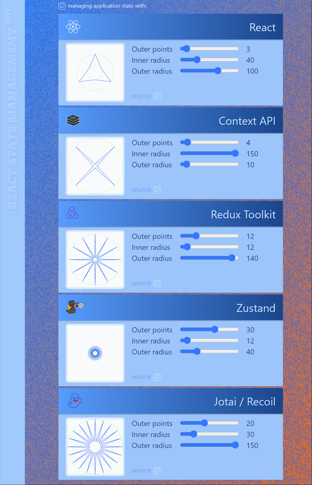

#### About

React state managment flavours.

1. React
1. Context
2. Moder Redux with @reactjs/toolkit
3. Zustand
4. Jotai

#### Links

* [React Context](https://reactjs.org/docs/context.html)
* [Redux documentation](https://redux.js.org/introduction/core-concepts)
* [Zustand documentation](https://docs.pmnd.rs/zustand)
* [Jotai documentation](https://docs.pmnd.rs/jotai)
* [Different State Management options](https://t.me/technologytm/15377)
